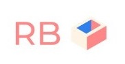

# RecoveryBox
> Full-Stack RecoveryBox mobile app containing both client (front-end) and server (back-end).


[](https://github.com/davzhardy/RecoveryBox/blob/master/LICENSE)
[](https://GitHub.com/davzhardy/RecoveryBox/issues)
[](https://shields.io)

<p align="center">
  
</p>

RecoveryBox is a mobile app aimed to help people in their journeys through twelve-step recovery programmes such as Alcoholics Anonymous. The app is a tool for people to document their meeting attendance, moods and the difficulties they encounter in their day-to-day lives. 

It documents the efforts made by programme participants and encourages continuing, sustainable interaction and self-reflection to stay on top of their recovery.

## Screenshots


## Installation

The app is built using react native, which means you'll need a way to run the app on a phone or emulator. To do this, you'll need to install [expo](https://expo.io/), follow the steps below to get it up and running:

1. Download [expo](https://expo.io/learn)
2. Install expo from your terminal
   ```
   npm install expo-cli --global
   ```
   
## Getting Started

1. Clone this repo!

   ```
   git clone https://github.com/davzhardy/RecoveryBox.git
   ```

2. Install dependencies and start the server.

   ```
   cd server      # Change into the server folder
   npm install    # Install dependencies
   nodemon        # Fire up the server
   ```

3. Install dependencies and start the client.

   ```
   cd ../client	  # Change into the client folder
   npm install    # Install dependencies
   expo start     # Start the Expo development environment that will build the JS bundle for the app
   ```

3. The Metro Bundler will now load in a new browser window and you can choose the platform where you want launch app. 

The App was tested on a Huawei P20 with android.

4. xxx

## Tech Stack

*FrontEnd*
* [React Native](https://facebook.github.io/react-native/) 
* [Redux](https://redux.js.org/)

*BackEnd*
* [Node.js](https://nodejs.org/)
* [Express](https://expressjs.com)
* [Sequelize ORM](https://sequelize.org)
* [PostgreSQL](https://www.postgresql.org)

## Author

David Hardy - [Github](https://github.com/davzhardy) - [Linkedin](www.linkedin.com/in/david-hardy50) 

Also check-out the development branch where [Daniel Alejandro Hernández Llerena](https://github.com/llere-alt) extended the project to add Authentication and Testing.

## License

MIT © [David Hardy](https://github.com/davzhardy)
